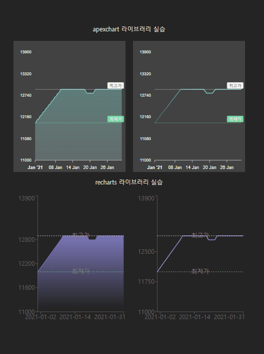

# 타 사이트 그래프 모음

## [폴센트](https://fallcent.com/)


## [로우차트](https://www.lowchart.com/)


## [지니알림](https://geniealert.co.kr/)


## [cpprices](https://www.cpprices.com/)


## [pricescharts](https://www.pricescharts.com/2024/06/apple-2023-24-m3-10-512gb-m3-8-16gb.html)


---

# 실습 결과



일반적인 가격변동 그래프에 사용되는 line 또는 area 그래프를 실습하였습니다.

`ApexCharts` 라이브러리와 `Recharts` 라이브러리를 사용했고,

- 공식문서나 개발 경험은 `Recharts` 라이브러리가 더 좋았지만,

- `ApexCharts` 라이브러리가 보다 원하는 디자인으로 커스텀하기 좋을 것 같습니다.

두 라이브러리 모두 데이터는 동일하게 다음과 같은 형태를 사용하였습니다.

```typescript
type DataType = {
	date: string;
	price: number;
};

type DataArray = DataType[];
```
